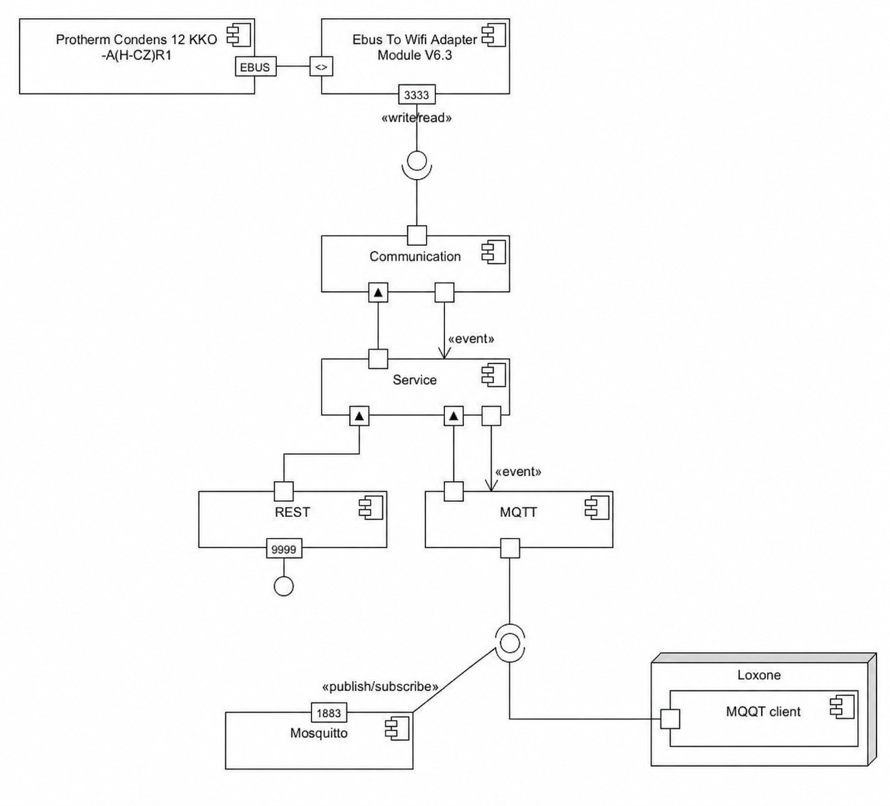

# EbusGateway

Gateway between **eBUS** and **MQTT/REST** for integrating **Protherm boilers** into smart-home systems.

The application connects to an eBUS TCP adapter, parses selected Protherm telegrams, exposes the current boiler state through a secured REST API, and republishes the same data to MQTT topics. It also supports writing selected room control values back to the boiler via REST or MQTT.

Current version: **1.5.1**

---

## Table of contents

- [What this project does](#what-this-project-does)
- [Key features](#key-features)
- [Architecture overview](#architecture-overview)
- [Supported telegrams and topics](#supported-telegrams-and-topics)
- [Requirements](#requirements)
- [Quick start](#quick-start)
- [Configuration](#configuration)
- [How to use the gateway](#how-to-use-the-gateway)
  - [REST API](#rest-api)
  - [MQTT publishing](#mqtt-publishing)
  - [MQTT write topics](#mqtt-write-topics)
- [Development guide](#development-guide)
  - [Project structure](#project-structure)
  - [Module dependencies](#module-dependencies)
  - [Data flow](#data-flow)
  - [Local development profile](#local-development-profile)
  - [Build, run and test](#build-run-and-test)
- [Troubleshooting](#troubleshooting)
- [Component diagram](#component-diagram)

---

## What this project does

EbusGateway acts as an integration layer between a **Protherm boiler on eBUS** and higher-level automation systems such as Home Assistant, Node-RED, Loxone, or custom dashboards.

It provides three main integration paths:

1. **Reads boiler state from eBUS** through a TCP eBUS adapter.
2. **Publishes boiler state to MQTT** as JSON payloads.
3. **Exposes boiler state and selected write operations via REST**.

This makes it possible to:

- monitor temperatures, pressure, heating flags, and pump states,
- change selected room-control settings,
- integrate the boiler into an MQTT-based smart home,
- inspect and test the system through Swagger UI / OpenAPI.

---

## Key features

- Spring Boot 3 / Java 21 multi-module application
- eBUS TCP client with reconnect and watchdog logic
- REST API for reading supported values and updating selected room-control parameters
- MQTT publisher for boiler data
- MQTT subscriber for selected write topics
- OpenAPI-generated DTOs and REST contract
- Built-in Swagger UI
- `DEV` profile with a mock eBUS server and embedded MQTT broker
- Basic Spring Security protection for REST endpoints and Swagger UI

---

## Architecture overview

At a high level, the application works like this:

1. `communication` connects to the eBUS adapter and parses telegrams.
2. Parsed telegrams are converted into DTOs in `service`.
3. `service` publishes internal application events when values change.
4. `controller` exposes DTOs through REST endpoints.
5. `mqtt` listens for service events and publishes them to MQTT topics.
6. `mqtt` can also receive selected write commands and forward them back to the service layer.

In other words:

**eBUS adapter -> communication -> service -> REST and MQTT**

For write operations:

**REST/MQTT command -> service -> communication -> eBUS adapter**

---

## Supported telegrams and topics

The following boiler data is currently supported.

### `10 08 B5 10` - RoomControlUnit

REST: `/protherm/roomControlUnit`  
MQTT publish topic: `protherm/roomControlUnit`

Fields:

- `leadWaterTargetTemperature`
- `serviceWaterTargetTemperature`
- `leadWaterHeatingBlocked`
- `serviceWaterHeatingBlocked`

### `10 08 B5 11 01 00` - BurnerControlUnit Block 0

REST: `/protherm/burnerControlUnits/block0`  
MQTT publish topic: `protherm/burnerControlUnits/block0`

Fields:

- `primaryTemperature`
- `waterPressure`
- `flameBurningPower`

### `10 08 B5 11 01 01` - BurnerControlUnit Block 1

REST: `/protherm/burnerControlUnits/block1`  
MQTT publish topic: `protherm/burnerControlUnits/block1`

Fields:

- `leadWaterTemperature`
- `returnWaterTemperature`
- `serviceWaterTemperature`
- `heatingOn`
- `serviceWaterOn`

### `10 08 B5 11 01 02` - BurnerControlUnit Block 2

REST: `/protherm/burnerControlUnits/block2`  
MQTT publish topic: `protherm/burnerControlUnits/block2`

Fields:

- `heatingEnabled`
- `serviceWaterEnabled`

### `03 64 B5 12` - HeaterController

REST: `/protherm/heaterController`  
MQTT publish topic: `protherm/heaterController`

Fields:

- `waterCirculatingPump`

### `03 15 B5 13` - FiringAutomat

REST: `/protherm/firingAutomat`  
MQTT publish topic: `protherm/firingAutomat`

Fields:

- `internalPump`

### Unknown telegrams

REST: `/protherm/unknowns`

Fields:

- `data`
- `dateTime`

---

## Requirements

### Runtime

- Java **21+**
- Maven **3.9+** recommended
- Running MQTT broker, unless you use the `DEV` profile
- Reachable eBUS TCP adapter, unless you use the `DEV` profile

### Default configuration values

- Default HTTP port: `9999`
- Default eBUS adapter: `10.0.0.1:3333`
- Default MQTT broker: `tcp://127.0.0.1:1883`

---

## Quick start

### 1. Build the project

```bash
mvn clean install
```

This builds the full multi-module project and produces the runnable Spring Boot JAR in:

```text
application/target/application-1.5.1.jar
```

### 2. Configure the application

Edit:

```text
application/src/main/resources/application.properties
```

At minimum, review these properties:

```properties
server.port=9999
server.auth.username=admin
server.auth.password=Admin,12345

ebus.adapter.host=10.0.0.1
ebus.adapter.port=3333

mqtt.broker-url=tcp://127.0.0.1:1883
mqtt.client-id=protherm-client
mqtt.default-topic=protherm/telegrams
mqtt.qos=1
```

### 3. Run the application

```bash
java -jar application/target/application-1.5.1.jar
```

### 4. Open Swagger UI

After startup:

```text
http://localhost:9999/swagger-ui/index.html
```

You will be asked to log in with the configured credentials.

---

## Configuration

Main configuration file:

```text
application/src/main/resources/application.properties
```

### HTTP and security

- `server.port`: HTTP port for the REST API and Swagger UI. Default: `9999`
- `server.auth.username`: Login username. Default: `admin`
- `server.auth.password`: Login password. Default: `Admin,12345`

> REST endpoints under `/protherm/**` and Swagger UI are protected by Spring Security form login.

### eBUS adapter settings

- `ebus.adapter.host`: Hostname/IP of the eBUS TCP adapter. Default: `10.0.0.1`
- `ebus.adapter.port`: TCP port of the eBUS adapter. Default: `3333`
- `ebus.timeout`: Socket read timeout in ms. Default: `2000`
- `ebus.watchdog.interval`: Maximum allowed silence before reconnect, in ms. Default: `30000`
- `ebus.reconnect.pause`: Delay before reconnect attempt, in ms. Default: `2000`
- `ebus.sync-bytes-between-telegrams`: Expected number of `0xAA` bytes between telegrams. Default: `5`

### Collector / polling settings

- `collector.setter.enabled`: Enables sending write telegrams. Default: `true`
- `collector.getter.enabled`: Enables polling read telegrams. Default: `true`
- `collector.scheduler.rate`: Polling interval in ms. Default: `10000`

### MQTT settings

- `mqtt.broker-url`: Broker URL. Default: `tcp://127.0.0.1:1883`
- `mqtt.client-id`: MQTT client ID prefix. Default: `protherm-client`
- `mqtt.default-topic`: Default outbound topic fallback. Default: `protherm/telegrams`
- `mqtt.qos`: Configured QoS value. Default: `1`

### DEV profile

File:

```text
application/src/main/resources/application-DEV.properties
```

The `DEV` profile changes the eBUS adapter host to localhost and enables helper infrastructure:

- embedded **Moquette MQTT broker**,
- local **Protherm eBUS mock server**.

This makes local development possible without real boiler hardware.

---

## How to use the gateway

### REST API

Base URL:

```text
http://localhost:9999/protherm
```

Available REST endpoints:

- **GET** `/roomControlUnit`: Read current room-control state
- **PUT** `/roomControlUnit`: Update selected room-control values
- **GET** `/burnerControlUnits/block0`: Read burner block 0
- **GET** `/burnerControlUnits/block1`: Read burner block 1
- **GET** `/burnerControlUnits/block2`: Read burner block 2
- **GET** `/heaterController`: Read heater controller data
- **GET** `/firingAutomat`: Read firing automat data
- **GET** `/unknowns`: Read captured unknown telegrams

### Example: read room control data

```bash
curl -u admin:Admin,12345 http://localhost:9999/protherm/roomControlUnit
```

### Example: update room control data

```bash
curl -u admin:Admin,12345 ^
  -X PUT http://localhost:9999/protherm/roomControlUnit ^
  -H "Content-Type: application/json" ^
  -d "{\"leadWaterTargetTemperature\":55.0}"
```

The service applies **partial updates**. Only non-null fields are copied into the current state.

### Write consistency

`RoomControlUnitService` merges two asynchronous sources:

- **SET updates** coming from REST or MQTT
- **eBUS frames** coming from the boiler

Recent SET updates take precedence over delayed eBUS echo frames, so newly written values are not immediately overwritten by stale device feedback.

### MQTT publishing

The application publishes JSON payloads to the following topics:

- `protherm/roomControlUnit`: `RoomControlUnitDto`
- `protherm/burnerControlUnits/block0`: `BurnerControlUnitBlock0Dto`
- `protherm/burnerControlUnits/block1`: `BurnerControlUnitBlock1Dto`
- `protherm/burnerControlUnits/block2`: `BurnerControlUnitBlock2Dto`
- `protherm/heaterController`: `HeaterControllerDto`
- `protherm/firingAutomat`: `FiringAutomatDto`

Payloads are serialized as JSON by Jackson.

Example payload:

```json
{
  "data": "10 08 B5 10 ...",
  "dateTime": "2026-05-19T15:00:00Z",
  "leadWaterTargetTemperature": 55.0,
  "serviceWaterTargetTemperature": 48.0,
  "leadWaterHeatingBlocked": 0,
  "serviceWaterHeatingBlocked": 0
}
```

### MQTT write topics

The gateway currently subscribes to:

```text
protherm/roomControlUnit/+
```

Supported MQTT write topics:

- `protherm/roomControlUnit/leadWaterTargetTemperature`: `double` - Set target lead-water temperature
- `protherm/roomControlUnit/serviceWaterTargetTemperature`: `double` - Set target service-water temperature
- `protherm/roomControlUnit/leadWaterHeatingBlocked`: `integer` - Block or enable lead-water heating
- `protherm/roomControlUnit/serviceWaterHeatingBlocked`: `integer` - Block or enable service-water heating

Example:

```bash
mosquitto_pub -h 127.0.0.1 -t protherm/roomControlUnit/leadWaterTargetTemperature -m 55
```

Notes:

- Empty MQTT payload is interpreted as `0`.
- Unknown topics are ignored and logged as errors.

---

## Development guide

### Project structure

This is a Maven multi-module project:

```text
EbusGateway/
├── api/            # OpenAPI spec and generated REST/model interfaces
├── application/    # Spring Boot entry point, security, runtime config
├── communication/  # eBUS TCP client, parsing, reconnect logic, mocks
├── controller/     # REST controller implementation
├── mqtt/           # MQTT publisher/subscriber integration
└── service/        # DTO state, converters, event publishing, orchestration
```

### Module dependencies

The module graph is intentionally layered:

```text
communication
    ↑
service  ← api
    ↑
controller
    ↑
application → mqtt
```

In practice:

- `service` depends on `communication` and `api`
- `controller` depends on `service`
- `mqtt` depends on `service`
- `application` depends on `controller` and `mqtt`

This keeps low-level eBUS handling separate from transport layers such as REST and MQTT.

### Data flow

#### Read flow

1. `EbusReaderWriter` maintains the TCP connection to the eBUS adapter.
2. `DataCollector` schedules read/write telegrams.
3. `DataEventFactory` publishes typed events for recognized telegrams.
4. Individual services convert telegrams into DTOs.
5. Services publish MQTT events.
6. `MqttPublisherListener` republishes DTOs to MQTT.
7. `ProthermController` exposes DTOs through REST.

#### Write flow

1. A command arrives via REST `PUT /protherm/roomControlUnit` or MQTT topic `protherm/roomControlUnit/...`.
2. `RoomControlUnitService` merges the partial update into its current DTO state.
3. The DTO is converted back to an eBUS telegram.
4. `DataCollector` sends the telegram in the next cycle / immediate update path.

### Local development profile

For local development, use the `DEV` profile.

What it enables:

- `communication.mock.ProthermEbusMockServer` on port `3333`
- embedded MQTT broker via Moquette
- local eBUS adapter target `127.0.0.1`

Run with:

```bash
mvn -pl application -am spring-boot:run -Dspring-boot.run.profiles=DEV
```

This is the simplest way to develop and verify the integration without access to real hardware.

### Build, run and test

#### Full build

```bash
mvn clean install
```

#### Run packaged JAR

```bash
java -jar application/target/application-1.5.1.jar
```

#### Run directly from Maven

```bash
mvn -pl application -am spring-boot:run
```

#### Run tests

```bash
mvn test
```

#### Regenerate API code

The `api` module uses `openapi-generator-maven-plugin` and the source specification:

```text
api/src/main/resources/protherm.yaml
```

Generated outputs include:

- `com.joiner.ebus.api.*`
- `com.joiner.ebus.model.*`

To rebuild generated code as part of the normal build:

```bash
mvn clean install
```

### Developer notes

- The REST contract is defined in OpenAPI and implemented by `ProthermController` via `DefaultApi`.
- `RoomControlUnitService` is currently the only writable stateful service.
- MQTT publishing is event-driven rather than implemented by polling the REST layer.
- Unknown eBUS frames are collected separately and exposed through `/protherm/unknowns`.
- Security is intentionally simple and uses in-memory credentials loaded from properties.

---

## Troubleshooting

### Application starts, but no live data arrives

Check:

- `ebus.adapter.host` and `ebus.adapter.port`
- whether the TCP adapter is reachable from the host running the app
- whether the adapter actually streams supported telegrams

### MQTT works in DEV but not in production

In `DEV`, the app starts an embedded broker. In production, you must provide your own external MQTT broker and point `mqtt.broker-url` to it.

### REST returns login page / authentication is required

This is expected. Endpoints under `/protherm/**` and Swagger UI require login. Use the configured values from:

- `server.auth.username`
- `server.auth.password`

### Wrote a new value, but boiler state briefly looks older

The system is designed to suppress stale eBUS echo frames after a write. If timing still looks wrong, review:

- `collector.scheduler.rate`
- eBUS adapter latency
- whether your integration writes too frequently

---

## Component diagram



---

## License

This project is distributed under the terms of the license included in the repository: [LICENSE](LICENSE).
